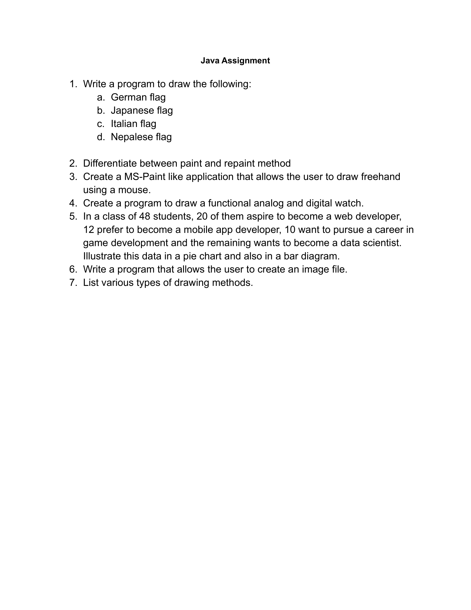

# Java Assignment: Network Programming 

# Question

# Question no.1:- Write a program to draw the following:
- # a) Nepalese Flag
- # b) German Flag
- # c) Italian Flag
- # d) Japanese Flag

Answer:-

**NEPALESE FLAG:-** "[Nepal.java](https://github.com/dhunganaPradeep/Java/blob/main/Assignments/Graphics/Nepal.java)"

**GERMAN FLAG:-** "[German.java](https://github.com/dhunganaPradeep/Java/blob/main/Assignments/Graphics/German.java)"

**ITALIAN FLAG:-** "[Italy.java](https://github.com/dhunganaPradeep/Java/blob/main/Assignments/Graphics/Italy.java)"

**JAPANESE FLAG:-** "[Japanese.java](https://github.com/dhunganaPradeep/Java/blob/main/Assignments/Graphics/Japanese.java)"

# Question no.2:- Differentiate between paint and repaint() method.

Answer:-

 | Paint  | Repaint |
| ------------- | ------------- |
|The paint() method is called when some action is performed on the window. |Whenever a repaint method is called, the update method is also called along with paint() method. |
|This method supports painting via graphics object. | This method is used to cause paint() to be invoked by the AWT painting thread.|

# Question no.3 :- Create a MS_Paint like application that allows the user to draw freehand using a mouse.

Answer:-

 "[PaintProgram.java](https://github.com/dhunganaPradeep/Java/blob/main/Assignments/Graphics/PaintProgram.java)"  

# Question no.4:-  Create a program to draw a functional analog and digital watch.

Answer:- 

**ANALOG WATCH:-** "[AnalogWatch.java](https://github.com/dhunganaPradeep/Java/blob/main/Assignments/Graphics/AnalogWatch.java)"

**DIGITAL WATCH:-** "[Digital.java](https://github.com/dhunganaPradeep/Java/blob/main/Assignments/Graphics/Digital.java)"

  
# Question no.5:-   In a class of 48 students, 20 of them aspire to become a web developer, 12 prefer to become a mobile app developer, 10 want to pursue a career in game development and the remaining wants to become a data scientist. Illustrate this data in a pie chart and also in a bar diagram..

Answer:- 
**PIE CHART:-** "[PieChart.java](https://github.com/dhunganaPradeep/Java/blob/main/Assignments/Graphics/PieChart.java)"

**BAR DIAGRAM:-** "[Bar.java](https://github.com/dhunganaPradeep/Java/blob/main/Assignments/Graphics/Bar.java)"

# Question no.6:- Write a program that allows the user to create an image file.

Answer:- "[CreateImage.java](https://github.com/dhunganaPradeep/Java/blob/main/Assignments/Graphics/CreateImage.java)"

## Output :
   **PNG Image** 
   **JPG Image** 

# Question no. 7:- List Various type of Drawing methods.

Answer:-

**Steps to create the TCP Client and Server :**

- Drawing (or printing) texts on the graphics screen:

   drawString(String str, int xBaselineLeft, int yBaselineLeft);

- Drawing lines:
   - drawLine(int x1, int y1, int x2, int y2);
   - drawPolyline(int[] xPoints, int[] yPoints, int numPoint);

- Drawing primitive shapes:
   - drawRect(int xTopLeft, int yTopLeft, int width, int height);
   - drawOval(int xTopLeft, int yTopLeft, int width, int height);
   - drawArc(int xTopLeft, int yTopLeft, int width, int height, int startAngle, int arcAngle);
   - draw3DRect(int xTopLeft, int, yTopLeft, int width, int height, boolean raised);
   - drawRoundRect(int xTopLeft, int yTopLeft, int width, int height, int arcWidth, int arcHeight)
   - drawPolygon(int[] xPoints, int[] yPoints, int numPoint);

- Filling primitive shapes:
   - fillRect(int xTopLeft, int yTopLeft, int width, int height);
   - fillOval(int xTopLeft, int yTopLeft, int width, int height);
   - fillArc(int xTopLeft, int yTopLeft, int width, int height, int startAngle, int arcAngle);
   - fill3DRect(int xTopLeft, int, yTopLeft, int width, int height, boolean raised);
   - fillRoundRect(int xTopLeft, int yTopLeft, int width, int height, int arcWidth, int arcHeight)
   - fillPolygon(int[] xPoints, int[] yPoints, int numPoint);
 
- Drawing (or Displaying) images:
   - drawImage(Image img, int xTopLeft, int yTopLeft, ImageObserver obs);  // draw image with its size
   - drawImage(Image img, int xTopLeft, int yTopLeft, int width, int height, ImageObserver o);  // resize image on screen
