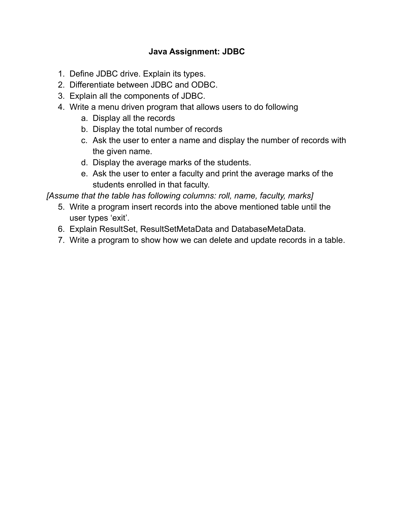
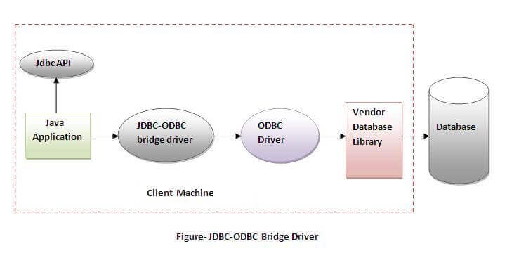
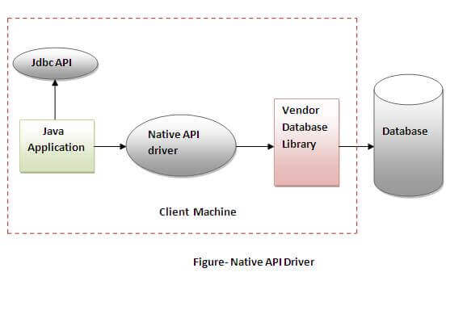
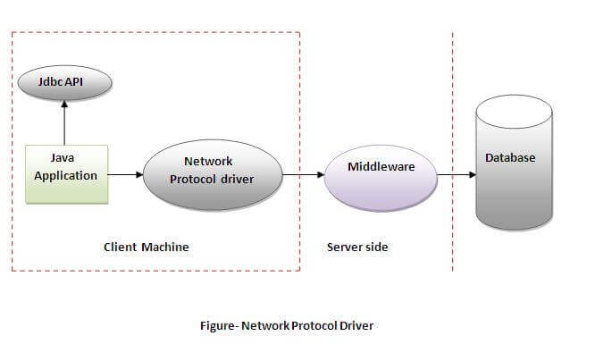
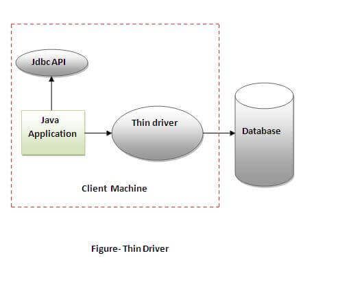
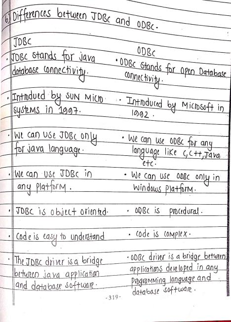

# Java Assignment: Chapter 1 & 2

# Question

# Question no.1:- Discuss the features of JavaDefine JDBC drive. Explain its types.

Answer:-

   JDBC (Java Database Connectivity) driver is a software 	component that enables Java applications to interact with a 	database. 
    • It allows Java code to execute SQL statements and retrieve results from a database.
    • It serves as a bridge between a Java application and a specific database management system.
    • JDBC drivers come in different types, such as JDBC-ODBC bridge driver, Native-API driver, Network Protocol driver and Thin driver.
    • The most commonly used type of JDBC driver is the JDBC-ODBC bridge driver, which allows Java applications to access data stored in databases that have an ODBC driver.
    • You need to install a JDBC driver for the specific database you want to connect to in order to use JDBC.
    • With the JDBC driver, Java application can connect to any relational database.

   Types of JDBC Driver : 

    - JDBC-ODBC Driver (Type 1 Driver)
    - Native-API Driver (Type 2 Driver )
    - Network Protocol Driver (Type 3 Driver)
    - Thin Driver (Type 4 Driver)  
    
**1. JDBC-ODBC Driver ( Type 1 Driver )**

Type 1 JDBC driver, also known as the JDBC-ODBC 		bridge driver, uses an ODBC driver to connect to a database. 	The ODBC driver must be installed on each client machine and 	a Data Source Name (DSN) must be configured to represent the 	target database.

   Advantages of Type 1 JDBC driver:

    - It is easy to set up and use.
    - It allows Java applications to connect to any database that has an ODBC driver.

   Disadvantages of Type 1 JDBC driver:

    - It has poor performance compared to other types of JDBC drivers.
    - It lacks support for new features and functions of newer databases.
    - It can have security issues because the ODBC driver is installed on the client machine, which can make it vulnerable to attacks.

**2.Native-API Driver ( Type 2 Driver )**

Type 2 JDBC driver, also known as a Native-API driver, 	uses a database-specific API to connect to a database. Instead of 	using a middleware JDBC-ODBC bridge, it directly calls the 	database API. Each database has its own Native-API driver.

   Advantages of Type 2 JDBC driver:

    - It has better performance compared to Type 1 driver (JDBC-ODBC bridge driver) because it doesn't use a middleware JDBC-ODBC bridge.
    - It can provide access to advanced features and functions of the specific database being used.

   Disadvantages of Type 2 JDBC driver:

    - It is not platform-independent, as it is specific to a particular 	database.
    - It requires a separate driver for each database, which can make it difficult to switch between databases.
    - It may have limitations compared to using the database's native API.

**3.Network Protocol Driver ( Type 3 Driver )**

A Type 3 JDBC driver, also known as a network protocol 	driver, is a driver that uses a middleware component, such as a 	Java-based application server, to connect to a database. The 	middleware component acts as a bridge between the Java 	application and the database, and it communicates with the 	database using a database-specific protocol.

Advantages of Type 3 JDBC driver:

    - It allows for platform-independence, as Java code can be run on any operating system that has a Java Virtual Machine (JVM) installed.
    - It provides high performance as it uses a specific protocol for the database, which can be more efficient than using a generic protocol.

   Disadvantages of Type 3 JDBC driver:

    - It can have additional latency due to the middleware component, which can add an extra hop between the Java application and the database.
    - It can be complex to set up and configure, as it requires a middleware component to be installed and configured.
    - It may have security issues if the middleware component is not properly configured and secured.

**4.Thin Driver ( Type 4 Driver )**

A Type 4 JDBC driver, also known as the Native-protocol 	pure Java driver, is a pure Java implementation of the database 	protocol. It communicates directly with the database server 	using the database's own network protocol.

   Advantages of Type 4 JDBC driver:

    - It has good performance, as it communicates directly with the database server using the database's own network protocol.
    - It is platform-independent, as it is written entirely in Java.
    - It supports advanced features and functions of newer databases.

   Disadvantages of Type 4 JDBC driver:

    - It requires a separate driver for each database, which can increase maintenance and support costs.
    - It may not be compatible with older versions of the database.

# Question no.2:- Differentiate between JDBC and ODBC.

Answer:-

   

# Question no.3:-Explain all the components of JDBC.

Answer:-

 There are generally four main components of JDBC through which it can interact with a database. They are as mentioned below: 

   **1) JDBC API :** 

   - Provides methods and interfaces for communication with databases.
   - Consists of two packages: java.sql.* for SE platform and java.sql.* for EE platform
   - Allows for WORA (write once, run anywhere) capabilities
   - Provides a standard for connecting a database to a client application
   - Syntax :

            import java.sql.*;
		      Connection conn = DriverManager.getConnection("jdbc:<subprotocol>:<subname>","username","password");
         

   **2) JDBC Driver Manager :** 

   - Loads a specific driver for a given application and database
   - Used to make database-specific calls to the database to process user requests
   - Syntax :

            Class.forName("com.mysql.jdbc.Driver");

   **3) JDBC Test Suite :** 

   - Used to test operations (such as insertion, deletion, and updates) performed by JDBC Drivers
   - Can be used to test the functionality of different drivers and ensure they are working correctly
   - Syntax:

            Statement stmt = conn.createStatement(); 
            stmt.executeUpdate("INSERT INTO table_name VALUES(value1,value2,value3)");
   
   **4) JDBC-ODBC Bridge Drivers :** 

   - Connects JDBC drivers to the database
   - Translates JDBC method calls into ODBC function calls
   - Uses the sun.jdbc.odbc package which includes a native library to access ODBC characteristics
   - Syntax:

            import sun.jdbc.odbc.*;
            Driver d = new sun.jdbc.odbc.JdbcOdbcDriver();

# Question no.4:- Write a menu driven program that allows users to do following :
- # Display all the records
- # Display the total number of records
- # Ask the user to enter a name and display the number of records with the given name.
- # Display the average marks of the students.
- # Ask the user to enter a faculty and print the average marks of the students enrolled in that faculty.

Answer:-
  

# [Assume that the table has following columns: roll, name, faculty, marks]
# Question no.5:- Write a program insert records into the above mentioned table until the user types ‘exit’.

   Answer:- "[Insert.java](https://github.com/dhunganaPradeep/Java/blob/main/Assignments/JDBC%20Assignment/Insert.java)"

# Question no.6:- Explain ResultSet, ResultSetMetaData and DatabaseMetaData.

Answer:-

   
   **1) ResultSet:** 

   - Represents the result of a query executed against a database
   - Contains rows and columns of data returned by a SELECT statement
   - Allows for iterating through the rows of data and accessing the values in each column
   - Syntax Example : 
   
         Statement stmt = conn.createStatement();
		   ResultSet rs = stmt.executeQuery("SELECT* FROM table_name");
		   while (rs.next()) {
    		int id = rs.getInt("id");
    		String name = rs.getString("name");
    		System.out.println(id + " " + name);
		      }
         

   **2) ResultSetMetaData :** 

   - Provides information about the structure of a ResultSet, such as the number of columns and the data type of each column
   - Can be used to programmatically determine the structure of a ResultSet and access metadata about the results of a query
   - Syntax Example :
   
         ResultSetMetaData rsmd = rs.getMetaData();
		   int columnCount = rsmd.getColumnCount();
		   for (int i = 1; i <= columnCount; i++) {
    		String columnName = rsmd.getColumnName(i);
   		int columnType = rsmd.getColumnType(i);
    		System.out.println(columnName + " " + columnType);
		}

   **3) DatabaseMetaData :** 

   - Provides information about the database, such as the number of tables, the names of the tables, and the data types of columns in the tables
   - Can be used to programmatically determine the structure of a database and access metadata about the database
   - Syntax Example :
   
            DatabaseMetaData dbmd = conn.getMetaData();
		   String dbName = dbmd.getDatabaseProductName();
		   String dbVersion = dbmd.getDatabaseProductVersion();
		   System.out.println(dbName + " " + dbVersion);

# Question no. 7:- Write a program to show how we can delete and updte records in a table.

Answer:- "[DatabaseOperations.java](https://github.com/dhunganaPradeep/Java/blob/main/Assignments/JDBC%20Assignment/DatabaseOperations.java)"